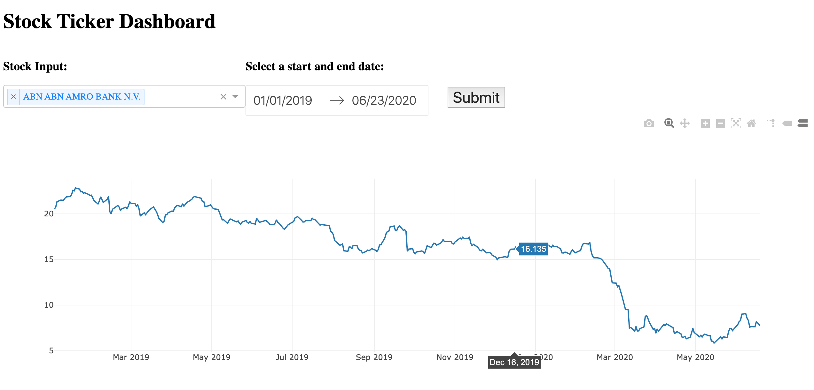

# Euronext Stock market tracker

This is my implementation of a basic price tracker for the EURO market. This was created in November 2019.

:shipit:

The libraries used are as follows:
- [Dash](https://dash.plotly.com/)
- [Pandas Datareader](https://pandas-datareader.readthedocs.io/en/latest/)
- [Pandas](https://pandas.pydata.org/)
- [Quandl](https://www.quandl.com/tools/python)

---

I was interested in recreating a stock tracker, like those seen in Apple's iOS Stocks application. At the same time, I was also interested in further exploring the use cases of Dash, as I had previously been using Plotly for a data visualisation project for an internship.

In addition, Euronext was prodiving historical data in a convenient and cleaned format (ie. CSV) which helped me to extract the available stock tickers on the market at that particular time. (A caveat to using such a method to extract the ticker symbols from a static CSV file is that the tickers would not be updated. However, since I wanted a quick way to populate my ticker options, I found this to be the most efficient use of my time. Furthermore, this dashboard is not intended to have great longevity, but rather as a test case for myself.)

If you are interested in finding out about the Euronext market, you can find them <a href="https://www.euronext.com">here</a>.

## Overview

The flow of the script is as follows:

1. Ticker symbols arte extracted from the 'Euronext_Equities_2019-11-27.csv' file.
2. Once the Flask server is started, ticker symbols are used to populate the options dropdown. The user can select multiple symbols to compare the prices. Users can also select the timeframe of interest. 
3. Once the parameters are set, the user hits the 'Submit' button to show the price charts accordingly. The button has an update graph function, which retrieves the historical prices of the symbols from Quandl's API.

---

This repo consists of 1 Python file, 1 CSV file and 1 folder.

- screenshots folder -> image of default interface when server is loaded
- trackerViz.py -> extracts ticker symbols, calls on Quandl's API and contains the structure of the dashboard
- Euronext_Equities_2019-11-27.csv -> contains the ticker symbols on the Euronext market as of 27 November 2019

---

The image below shows the default dashboard interface.

